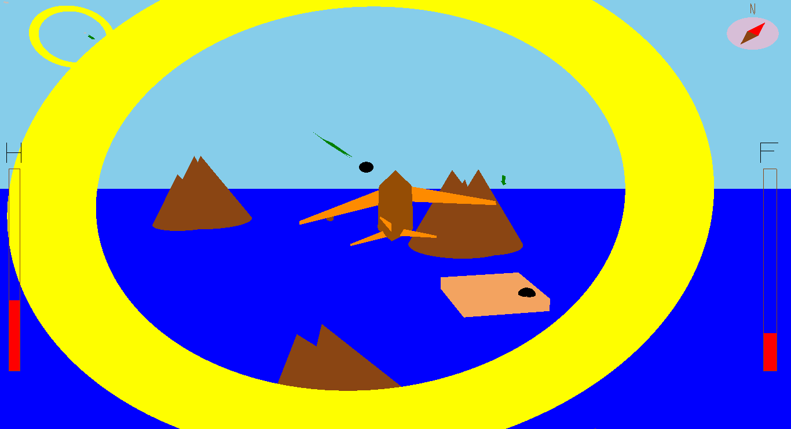
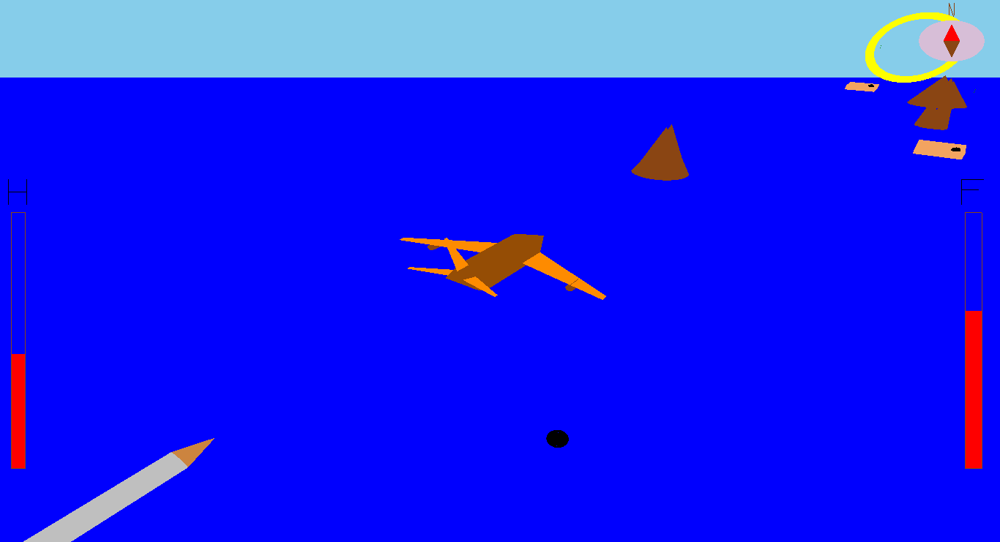
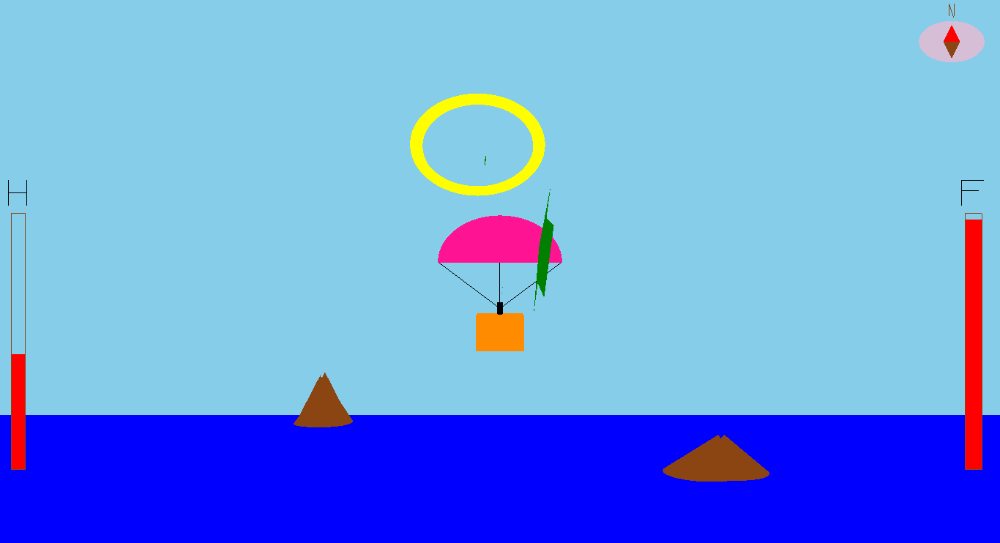

JetStrike
=========================

A Jet plane fighter game where the player travels in Jet plane following checkpoints, destroying obstacles, collecting powerups, upgrading plane etc

### Snaps
Here are some snap shots from the game
  
  

### How to run?
To install the game run the file install.sh after downloading 
cmd: `install.sh` 
To run the game run the file install.sh with '-r' argument 
 cmd: `install.sh -r` 

### How to play?

#### _Jet Controls_
<kbd>W</kbd>  &nbsp;&nbsp;&nbsp;&nbsp;&nbsp;&nbsp;&nbsp;&nbsp;&nbsp;&nbsp;&nbsp;&nbsp;&nbsp;&nbsp;&nbsp;&nbsp;&nbsp;&nbsp;&nbsp;&nbsp;&nbsp;-&nbsp;&nbsp;move forward 
<kbd>A</kbd> &nbsp;&nbsp;&nbsp;&nbsp;&nbsp;&nbsp;&nbsp;&nbsp;&nbsp;&nbsp;&nbsp;&nbsp;&nbsp;&nbsp;&nbsp;&nbsp;&nbsp;&nbsp;&nbsp;&nbsp;&nbsp;&nbsp;- &nbsp;roll anticlockwise 
<kbd>D</kbd> &nbsp;&nbsp;&nbsp;&nbsp;&nbsp;&nbsp;&nbsp;&nbsp;&nbsp;&nbsp;&nbsp;&nbsp;&nbsp;&nbsp;&nbsp;&nbsp;&nbsp;&nbsp;&nbsp;&nbsp;&nbsp;&nbsp;- &nbsp;roll clockwise 
<kbd>Q</kbd> &nbsp;&nbsp;&nbsp;&nbsp;&nbsp;&nbsp;&nbsp;&nbsp;&nbsp;&nbsp;&nbsp;&nbsp;&nbsp;&nbsp;&nbsp;&nbsp;&nbsp;&nbsp;&nbsp;&nbsp;&nbsp;&nbsp;- &nbsp;yaw left 
<kbd>E</kbd> &nbsp;&nbsp;&nbsp;&nbsp;&nbsp;&nbsp;&nbsp;&nbsp;&nbsp;&nbsp;&nbsp;&nbsp;&nbsp;&nbsp;&nbsp;&nbsp;&nbsp;&nbsp;&nbsp;&nbsp;&nbsp;&nbsp;- &nbsp;yaw right 
<kbd>Z</kbd> &nbsp;&nbsp;&nbsp;&nbsp;&nbsp;&nbsp;&nbsp;&nbsp;&nbsp;&nbsp;&nbsp;&nbsp;&nbsp;&nbsp;&nbsp;&nbsp;&nbsp;&nbsp;&nbsp;&nbsp;&nbsp;&nbsp;- &nbsp;pitch up 
<kbd>X</kbd> &nbsp;&nbsp;&nbsp;&nbsp;&nbsp;&nbsp;&nbsp;&nbsp;&nbsp;&nbsp;&nbsp;&nbsp;&nbsp;&nbsp;&nbsp;&nbsp;&nbsp;&nbsp;&nbsp;&nbsp;&nbsp;&nbsp;- &nbsp;pitch down 
<kbd>Left click</kbd> &nbsp;&nbsp;&nbsp;&nbsp;&nbsp;&nbsp;&nbsp;&nbsp;&nbsp;&nbsp;-&nbsp; shoot bullets 
<kbd>Right click</kbd> &nbsp;&nbsp;&nbsp;&nbsp;&nbsp;&nbsp;&nbsp;&nbsp;-&nbsp; throw bombs

##### _Camera Controls_
<kbd>F1</kbd> - plane view 
<kbd>F2</kbd> - top view 
<kbd>F3</kbd> - tower view 
<kbd>F4</kbd> - follow view 
<kbd>F5</kbd> - helicopter view 

Follow the directional arrows, pass through the rings, destroy obstacles and reach destination.

### How to report bugs?
Please email to [sritejakittu777@gmail.com](mailto:sritejakittu777@gmail.com) with the bug report.

 